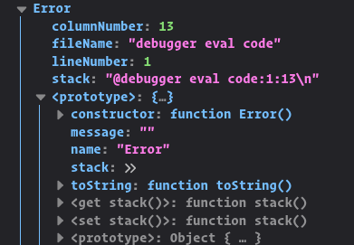

# Les classes en JavaScript : l'héritage

Reprenons notre classe CustomErrors, son utilité est de capturer les erreurs ou elles se produisent, et par la suite, on affiche un message d'erreur.

En JavaScript, au même titre que la classe Date ou Math, on a accès a la classe Error.

Ouvrez la console `f12` et taper le code suivant:

```javascript
console.dir(new Error());
```

  

On voit quand on clique sur 'prototype' que la class Error native possède une propriété 'message'. Nous reviendrons plus tard sur ce qu'est le prototype.

Notre classe CustomErrors ne possède pas de telle propriété, mais on en aurait bien besoin

Plutot que créer une propriété message sur notre classe, on va faire en sorte d'hériter des propriétés de la classe native.

```javascript
class CustomErrors extends Error {}
```

Le mot-clé

    extends

Grâce a ce mot-clé, on peut hériter de toutes les propriétés et méthodes de la classe parente. Quand on hérite d'une classe en JavaScript, si les deux classes ont un constructeur on doit appeler la méthode

    super()

pour initialiser le constructeur de la méthode parente. Et appeler cette méthode avant l'utilisation du mot-clé `this`

-   Quand on instancie une classe avec `new`, on crée un objet vide et on y assigne `this`
-   Mais quand on le fait avec une classe derivée, celle ci attend de la classe parente qu'elle fasse ce travail.

```javascript
class CustomErrors extends Error {
    constructor() {
        super(); // Le constructeur de la classe parente.
    }

    recordErrors(errors) {
        this.message = errors;
    }

    getErrors() {
        return this.message;
    }
}

export default CustomErrors;
```

Après cette opération, on a accès a la propriété message de la classe parente. Et le mot-clé `this` est initialisé.

```javascript
import CustomErrors from './CustomErrors.js';
// Une erreur s'est produite
const errorMessage = {
    error: 'unknown',
    message: 'Same player play again',
};

// On instancie la classe
const customError = new CustomErrors();

// On enregistre le message
customError.recordErrors(errorMessage);

// Grace a l'heritage, on accede a la propriete message de la classe parente.
console.log(customError.getErrors());

console.log(customError);
```

`f12` <span>😉</span>
