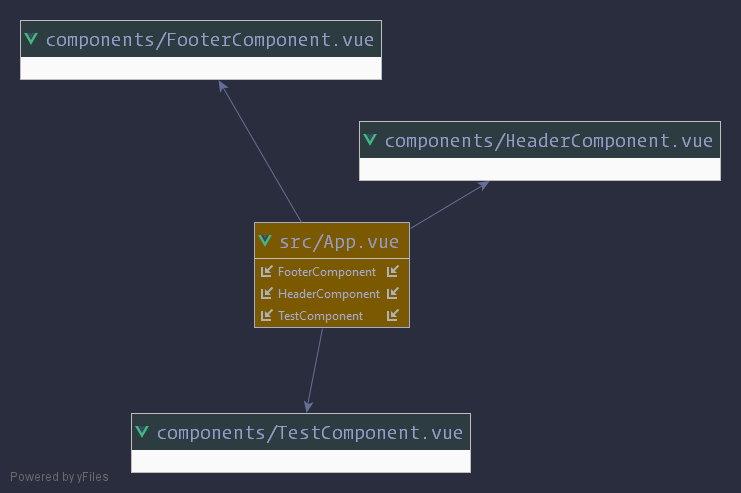

# L'extension .vue

Jusqu'à maintenant, nous avons tout codé dans un seul fichier, ce qui n'est évidemment pas l'idéal.

Vue offre la possibilité de travailler avec des fichiers dédiés, avec une extension .vue.

Pour développer proprement et efficacement avec Vue.js, vous allez devoir travailler avec des fichier .vue. L'avantage d'un fichier .vue pour un composant est qu'on peut le réutiliser ou on veut, dans n'importe quelle application, il suffira d'enregister le composant

On code ici avec plusieurs librairies qui s'occuperont de la compilation des fichiers .vue en JavaScript. Vous aurez donc quelques lignes commandes à retenir

Le fichier package.json fourni sert à installer les librairies avec la commande
```bash 
npm install
```
Quand ce script a été exécuté, la commande suivante va récupérer les fichiers JS et .vue situé dans le dossier src et les compiler en un seul fichier JS lisible par un navigateur :
```bash 
npm run build
```
Enfin la dernière commande permettra de démarrer un serveur dont la racine est le répertoire dist, chaque modification apporté à un fichier .vue sera automatiquement pris en compte et compilé, vous n'aurez pas a rafraîchir le navigateur.
```bash 
npm run dev
```
Voici quelques schémas pour décrire la page que êtes en train de lire :

  
  
 

Voici la syntaxe d'un composant dans un fichier .vue

```html
<template>
    <div>
        <p>Votre template</p>
    </div>
</template>
<script>
    export default {
        data() {
            return {
                //
            }
        },
        computed : {
            //
        },
        methods: {
            //
        }
    }
</script>
<!-- balise style facultative, l'attribut scoped optionnel est équivalent à une ID.
    Le style sera appliqué uniquement au template de ce fichier -->
<style scoped>
    .container {
        margin: auto;
    }
</style>
```

### Introduction aux props:

Les props sont des propriétés que l'on passe à un composant à l'endroit où on se sert du composant. Il peut avoir n'importe quelle valeur, des images d'un slider par exemple

    <slider-component :images=""></slider-component>

On le récupère dans le fichier .vue :
```html
<template>
    <div>
       <div class="slider">              <!--     -->
            
        </div>
    </div>
</template>
<script>
    export default {
        // Déclarer les props ici
        props: ['images'],
        data() {
            return {
                sliderImages: ''
            }
        },
        // méthode appelé automatiquement au chargement du composant
        mounted() {
            this.sliderImages = this.$props.images; // on y accède par this.$props
        }
    }
</script>
```
